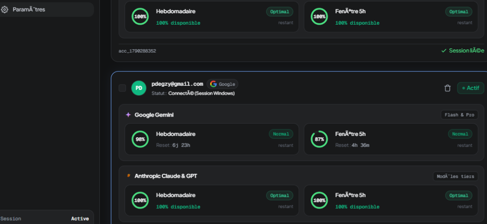

<div align="center">

  

  # Antigravity Manager
  
  **Le switcher multi-comptes ultime & moniteur de quotas en direct pour Google Antigravity.**

  [](https://github.com/BOZOHQ/antigravity-manager/releases)
  [](https://github.com/BOZOHQ/antigravity-manager/releases)
  [](https://tauri.app)
  [](LICENSE)

  <br />

  <p align="center">
    <a href="https://github.com/BOZOHQ/antigravity-manager/releases/latest"><b>⚡ Télécharger l'Installeur Windows (.exe)</b></a> •
    <a href="#-pourquoi-ce-projet-">Pourquoi ce projet ?</a> •
    <a href="#-fonctionnalit%C3%A9s">Fonctionnalités</a> •
    <a href="#-installation-rapide">Installation</a>
  </p>

  <br />

  <!-- Preview Screenshot avec cadre sombre et ombre -->
  

</div>

<br />

---

## 💡 Pourquoi ce projet ?

Si tu développes intensivement sur **Google Antigravity**, tu connais la galère :
- Les quotas **Gemini Pro** et **Claude 3.5 Sonnet** fondent à vue d'œil.
- Changer de compte Google dans l'IDE oblige à tout déconnecter manuellement, ré-ouvrir le navigateur, se retaper l'authentification et relancer l'éditeur.
- Aucune vue globale pour savoir quel compte a encore du quota sous le capot.

**Antigravity Manager règle ça définitivement.**  
Une application desktop ultra-légère en **Rust + Tauri v2** qui tourne en tâche de fond, interroge directement les quotas de tous tes comptes via l'API officielle Google Cloud Code, et **swappe ta session active à chaud en 1 clic** directement dans le trousseau Windows (`gemini:antigravity`).

---

## ⚡ Fonctionnalités

### 🔄 Hot-Swap instantané de compte
Passe d'un compte à un autre instantanément. Antigravity Manager injecte les jetons d'accès et rafraîchit automatiquement les sessions dans le trousseau Windows (`Windows Credential Manager`). L'IDE redémarre synchronisé sur le nouveau compte, sans friction.

### 📊 Télémétrie des quotas en direct
Surveille la disponibilité réelle de tous tes modèles :
- **Gemini Pro** (Quota 5h & Quota Hebdomadaire)
- **Claude 3.5 Sonnet** (Quota 5h & Quota Hebdomadaire)
- Fonctionne pour **tous tes comptes enregistrés en même temps**, même ceux non connectés à l'instant T.

### 🤖 Auto-Switch intelligent
Active le mode sentinelle : dès qu'un compte tombe sous les **5% de quota restant**, Antigravity Manager bascule automatiquement ta session sur le compte de ta flotte qui a le plus de jus.

### 🛡️ Zéro Fuite & 100% Local
- Aucun serveur intermédiaire, aucune télémétrie obscure.
- Tout est stocké localement sur ta propre machine (`accounts.json` & Credential Vault).
- Le mini-serveur d'authentification écoute uniquement sur ton interface de boucle locale `127.0.0.1:8045`.

---

## 📥 Téléchargement

Rends-toi sur la page des **[Releases](../../releases/latest)** :

| Version | Format | Description |
| :--- | :---: | :--- |
| **Setup Officiel** | `.exe` | **Recommandé** : Installeur propre, icônes système, raccourcis bureau et menu Démarrer. |
| **Version Portable** | `.exe` | Zéro installation : tu télécharges, tu cliques, ça tourne directement. |

---

## 🛠️ Stack Technique

- **Moteur :** Rust (Axum, Tokio, Reqwest avec TLS natif)
- **Interface :** Tauri v2, HTML5 / Tailwind CSS frameless ultra-réactif
- **Intégration OS :** Windows Credential Vault API (`wincred.h`), gestionnaire de processus découplés

---

## 🧑‍💻 Développer / Compiler localement

```bash
# 1. Cloner le repo
git clone https://github.com/BOZOHQ/antigravity-manager.git
cd antigravity-manager

# 2. Compiler l'installeur Windows release
cargo tauri build --bundles nsis
```

L'installeur est généré automatiquement dans `src-tauri/target/release/bundle/nsis/`.

---

<div align="center">
  <sub>Fait avec passion pour la communauté Antigravity. Licence MIT.</sub>
</div>
